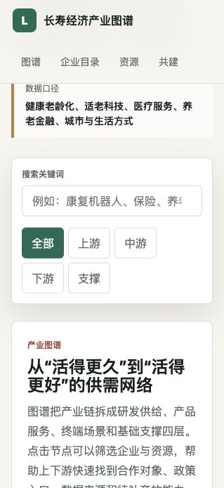

# 长寿经济产业图谱

一个面向长寿经济产业链上下游企业的开源网站原型，目标是让企业、研究者、开发者和投资人更容易查询产业节点、合作需求、公开报告和政策资源。



## 为什么做

长寿经济不是单一赛道，而是横跨生物医药、检测数据、智能硬件、医疗照护、居家养老、养老金融、适老城市和人才标准的产业网络。很多程序员也关心健康寿命和未来生活质量，所以这个项目适合用开源方式持续共建、审阅和迭代。

## 当前功能

- 产业链图谱：点击节点筛选对应企业与资源。
- 企业目录：展示企业类型、能力标签和合作需求。
- 资源目录：整理公开报告、全球倡议、数据方向和贡献模板。
- 静态部署：不依赖后端，可直接用于 GitHub Pages。

## 运行方式

直接在浏览器打开 `index.html`。

也可以在本地启动一个静态服务：

```bash
python3 -m http.server 8080
```

然后访问 `http://localhost:8080`。

## 建议的数据结构

企业或机构记录建议包含：

- `name`：企业或机构名称
- `node`：所属产业节点
- `stage`：上游、中游、下游或支撑
- `location`：地区或能力类型
- `need`：希望寻找的合作资源
- `tags`：能力标签
- `source`：公开来源链接
- `updatedAt`：更新时间
- `contributor`：贡献人或组织

资源记录建议包含：

- `kind`：政策、报告、数据库、标准、城市试点、融资事件等
- `title`：资源标题
- `summary`：一句话价值说明
- `node`：关联产业节点
- `url`：来源链接
- `updatedAt`：更新时间

## 初始参考来源

- WHO：United Nations Decade of Healthy Ageing 2021-2030  
  https://www.who.int/initiatives/decade-of-healthy-ageing
- AARP：Global Longevity Economy Outlook  
  https://www.aarp.org/pri/topics/work-finances-retirement/economics-aging/global-longevity-economy/

## 开源协议

- 网站代码使用 MIT License，见 `LICENSE`。
- 产业数据建议使用 CC BY 4.0，并要求贡献者提供来源链接。
- 新增企业、报告或政策资源时，优先通过 GitHub issue 讨论，再用 pull request 合并。
- 对医疗、金融和政策信息保留来源与日期，避免把示例数据误当成投资、医疗或法律建议。
