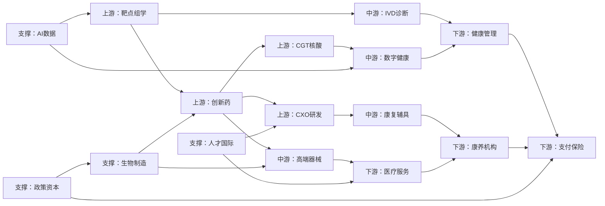

# 苏州 BioBAY 长寿经济产业图谱

更新时间：2026 年 6 月 4 日  
图谱定位：以苏州生物医药产业园 BioBAY 为核心，面向“健康寿命延长”的上游研发、中游产品、下游服务和生态支撑图谱。

## 一、总判断

BioBAY 的长寿经济图谱不能简单等同于养老产业图谱，也不能停留在传统生物医药产业链。更准确的定义是：

BioBAY 长寿经济 = 上游研发技术 + 中游药械与数字产品 + 下游医疗康养服务 + 支撑平台生态。

这条链路的目标是延长健康寿命，而不只是延长自然寿命。它面向肿瘤、心脑血管、代谢疾病、免疫炎症、神经退行性疾病、失能失智、术后康复和长期照护等老龄社会高频需求，把 BioBAY 的创新药械、生物技术、AI+BT、生物制造和园区政策资本能力，转化为可筛查、可治疗、可康复、可照护、可支付的长寿经济产品体系。

## 二、四层产业图谱

### 上游：研发与技术源头

| 节点 | BioBAY/园区能力 | 长寿经济连接 |
| --- | --- | --- |
| 靶点组学 | 靶点发现、多组学、分子检测、生物标志物 | 老龄疾病早期风险识别、伴随诊断、精准干预 |
| 创新药 | 抗体药物、细胞因子、代谢免疫、肿瘤药物、临床管线 | 肿瘤、代谢、免疫、心脑血管、神经退行性疾病治疗 |
| CGT 核酸 | 细胞与基因治疗、核酸药物、再生医学 | 功能修复、难治性疾病、健康寿命干预 |
| CXO 研发 | CRO、临床研究、药效评价、注册研究 | 老年人群临床试验、真实世界研究、转化效率提升 |

### 中游：产品与解决方案

| 节点 | BioBAY/园区能力 | 长寿经济连接 |
| --- | --- | --- |
| IVD 诊断 | 体外诊断、分子诊断、伴随诊断 | 肿瘤早筛、慢病筛查、风险分层、机构体检 |
| 高端器械 | 植介入器械、医疗机器人、微创治疗设备 | 老年高发疾病治疗、微创干预、功能维持 |
| 数字健康 | 数字疗法、可穿戴、远程监测、数据平台 | 慢病管理、居家监测、康复随访、真实世界数据 |
| 康复辅具 | 康复设备、适老辅具、具身智能、照护系统 | 术后康复、失能预防、跌倒防护、照护减负 |

### 下游：服务与支付场景

| 节点 | BioBAY/园区能力 | 长寿经济连接 |
| --- | --- | --- |
| 健康管理 | 体检咨询、慢病管理、主动健康服务 | 预防、筛查、干预、随访的连续服务闭环 |
| 医疗服务 | 医院、专科中心、医养结合服务 | 创新药械临床验证、老年疾病综合管理 |
| 康养机构 | 养老院、福利院、康养机构、社区和居家照护 | 园区创新产品进入真实适老应用场景 |
| 支付保险 | 商业健康险、长期护理保险、苏惠保、机构采购 | 把疗效、康复和照护减负转化为支付闭环 |

### 支撑：平台与生态要素

| 节点 | BioBAY/园区能力 | 长寿经济连接 |
| --- | --- | --- |
| AI 数据 | AI 制药、生物大模型、实验自动化、健康数据 | 提升研发效率，支撑风险预测、用药管理和真实世界研究 |
| 生物制造 | 生物制造行动计划、公共技术平台、生产制造 | 缩短创新药械和健康产品产业化周期 |
| 政策资本 | 行动计划、审评审批、名优目录、融资、苏惠保 | 解决注册、推广、融资、采购、支付问题 |
| 人才国际 | 高层次人才、院校平台、新加坡合作、海外 BD | 补齐交叉人才、国际注册、出海和全球合作能力 |

## 三、主链路

## 四、关键补链方向

1. 上游要从“研发管线”补到“老龄疾病组合方案”。围绕肿瘤、代谢、心脑血管、免疫炎症、神经退行性疾病，形成药物、诊断、康复和长期管理组合。
2. 中游要从“药械产品”补到“健康寿命解决方案”。重点发展 IVD 早筛、可穿戴监测、微创器械、医疗机器人、康复辅具、数字疗法和养老照护系统。
3. 下游要从“销售渠道”补到“真实场景闭环”。让 BioBAY 的创新药械进入医院、体检机构、康养机构、社区和居家照护，形成真实世界数据和服务反馈。
4. 支撑要从“政策扶持”补到“产业化制度工具”。把行动计划、审评审批、创新名优目录、苏惠保、商业保险、资本和国际 BD 组合起来，解决产品商业化最后一公里。
5. 长寿经济主线必须贯穿全图谱。每个节点都要回答同一个问题：它如何帮助老龄人群更早筛查、更有效治疗、更快康复、更低成本照护、更长期保持功能能力。

## 五、代表企业/主体案例

下表不是完整名录，而是用于把 BioBAY 的产业能力映射到长寿经济节点。每条记录都保留“待验证问题”，便于后续继续补来源、产品、适应症和场景数据。

| 企业/主体 | 所属节点 | 产品或能力 | 长寿经济价值 | 当前证据 | 来源链接 | 待验证问题 |
| --- | --- | --- | --- | --- | --- | --- |
| 信达生物 | 创新药 | 肿瘤、心血管及代谢、自身免疫、眼科等综合产品管线 | 面向老龄高发疾病提供治疗选择，并连接医保、商保和真实世界随访 | 园区专题报道将信达列为 BioBAY 孵化代表企业，并提到其多领域管线 | [苏州工业园区管委会](https://www.sipac.gov.cn/szgyyq/zmjxs/202411/dc619f054f7a4868865a87a4d41321a3.shtml) | 逐项补充已上市产品、适应症、医保/商保覆盖和老年人群数据 |
| 基石药业 | 创新药 / 出海 BD | 肿瘤免疫和靶向药物，境外商务合作 | 将园区创新药管线连接全球市场和老龄肿瘤治疗需求 | 园区专题报道将基石列入 2023 年以来 BioBAY 20 余家境外商务交易企业 | [苏州工业园区管委会](https://www.sipac.gov.cn/szgyyq/zmjxs/202411/dc619f054f7a4868865a87a4d41321a3.shtml) | 补具体交易、产品、目标市场和患者可及性数据 |
| 亚盛医药 | 创新药 / 国际注册 | Bcl-2 等小分子创新药和全球临床研究 | 面向血液肿瘤等年龄相关高负担疾病，形成中国创新药国际注册样本 | 公开报道提到亚盛医药相关全球注册 III 期临床研究获得 FDA 和 EMA 认可 | [苏州工业园区管委会](https://www.sipac.gov.cn/szgyyq/mtjj/202509/6f1dc2ec020b412c8f533fc96d39d378.shtml) | 补老年患者亚组、临床终点和商业化路径 |
| 宜联生物 | 创新药 / ADC / 出海 BD | 抗体偶联药物等创新药平台 | 服务肿瘤治疗和更精准的长期疾病控制 | 园区专题报道将宜联生物列入 BioBAY 2023 年以来境外商务交易企业 | [苏州工业园区管委会](https://www.sipac.gov.cn/szgyyq/zmjxs/202411/dc619f054f7a4868865a87a4d41321a3.shtml) | 补具体管线、授权交易和老龄肿瘤适应症 |
| 纽伦捷生物 | CGT 核酸 / 细胞重编程 | 原位转分化、体内细胞重编程相关技术 | 对神经系统疾病、肿瘤和功能修复具有长寿医学想象空间 | BioBAY 官网新闻显示其完成近亿元融资，并定位于原位转分化技术 | [BioBAY 官网](https://www.biobay.com.cn/) | 补临床阶段、适应症、动物/人体证据和监管路径 |
| 星锐医药 | 核酸药物 / 创新疗法 | 创新药物研发和融资能力 | 为老龄疾病干预提供新技术平台储备 | BioBAY 官网新闻显示其完成近 4000 万美元 B+ 轮融资 | [BioBAY 官网](https://www.biobay.com.cn/) | 补管线方向、核心技术和是否对应老龄疾病 |
| 金翼医疗 | CXO 研发 / 医疗器械转化 | 医疗器械临床前大动物实验服务 | 支撑植介入器械、康复设备和创新医疗器械进入临床验证 | 园区专题报道提到金翼医疗 2022 年入驻 BioBAY，聚焦医疗器械临床前大动物实验 | [苏州工业园区管委会](https://www.sipac.gov.cn/szgyyq/zmjxs/202411/dc619f054f7a4868865a87a4d41321a3.shtml) | 补服务过的长寿经济产品类型和验证案例 |
| 苏州创新药研究院 | AI 数据 / 政产学研医 | 分子靶向药物、生物药、基因与细胞治疗、AI 药物研发的组织化科研转化 | 把“企业出题、联合解题、政府助题”嵌入实验室、企业、医院闭环 | 苏州市市场监管局报道提到苏州市政府、园区与苏州大学共建该院 | [苏州市市场监督管理局](https://scjgj.suzhou.gov.cn/szqts/mtbd/202601/b08b56caabb5456bb7eff4bd0d2b5903.shtml) | 补与 BioBAY 企业的具体合作项目和转化成果 |
| 园区康养机构采购场景 | 康养机构 / 支付保险 | 养老院、福利院、康养机构采购具身智能、可穿戴、康复辅具、养老照护系统 | 将创新药械和适老科技导入真实照护场景，形成应用数据和支付依据 | 2025-2027 腾飞行动计划明确引导康养机构采购智能化适老化产品 | [苏州市人民政府](https://www.suzhou.gov.cn/szsrmzf/szyw/202505/20b233af1c82485f973929693b2c964e.shtml) | 补具体采购主体、产品清单、使用效果和支付方 |
| 创新名优目录与苏惠保机制 | 政策资本 / 支付保险 | 将创新医疗器械纳入名优目录和苏惠保，支持市场推广 | 将产品临床价值转化为可支付、可推广、可规模化的市场入口 | 苏州市人民政府报道提到园区推动创新医疗器械纳入名优目录及苏惠保 | [苏州市人民政府](https://www.suzhou.gov.cn/szsrmzf/ylfw/202509/4cf080e8e56149268d12e6f0a63f6359.shtml) | 补已纳入产品、赔付规则、患者覆盖和销售转化效果 |

## 六、应用场景

| 场景 | 连接节点 | 适合导入的产品/能力 | 可衡量结果 | 需要补充的数据 |
| --- | --- | --- | --- | --- |
| 老龄高发疾病早筛 | 靶点组学、IVD 诊断、健康管理 | 分子诊断、伴随诊断、体检咨询、慢病风险分层 | 早筛率、阳性后转诊率、随访依从性 | 机构体检数据、检测产品清单、随访周期 |
| 肿瘤与慢病治疗 | 创新药、CGT 核酸、医疗服务、支付保险 | 创新药、细胞与基因疗法、临床研究、医保商保 | 缓解率、生存期、生活质量、支付覆盖 | 已上市产品、临床终点、老年亚组数据 |
| 术后康复与功能维持 | 高端器械、康复辅具、康养机构 | 康复设备、植介入器械、可穿戴监测、远程随访 | 功能评分、跌倒率、再入院率、护理时长 | 康复场景、设备采购、真实使用效果 |
| 机构照护减负 | 数字健康、康复辅具、康养机构、AI 数据 | 养老照护系统、具身智能、可穿戴、护理排班和预警系统 | 照护效率、风险预警、护理人员负担 | 养老院/福利院试点清单、系统指标 |
| 国际化健康产业合作 | 人才国际、政策资本、生物制造 | 海外 BD、国际注册、生产制造、跨境合作 | 授权交易、海外注册、产能落地 | BD 金额、目标市场、注册进展 |

## 七、政策工具

| 政策工具 | 对应能力 | 长寿经济作用 | 来源 |
| --- | --- | --- | --- |
| “5511”企业培育体系 | 龙头企业、领军企业、重磅产品、重点管线 | 用明确目标推动企业规模化和产品上市，形成可持续产业梯队 | [苏州工业园区管委会](https://www.sipac.gov.cn/szgyyq/dthg202505/202505/6f1321f678114daf8b31e452815fab22.shtml) |
| 创新产品上市与应用推广 | 创新药、高端器械、大健康产品 | 把研发成果从注册上市推向医院、康养机构和真实市场 | [苏州市人民政府](https://www.suzhou.gov.cn/szsrmzf/szyw/202505/20b233af1c82485f973929693b2c964e.shtml) |
| 创新名优目录与苏惠保 | 医疗器械、支付保险、市场推广 | 为创新产品提供支付和推广入口，降低商业化阻力 | [苏州市人民政府](https://www.suzhou.gov.cn/szsrmzf/ylfw/202509/4cf080e8e56149268d12e6f0a63f6359.shtml) |
| AI 生物大模型与人工智能赋能 | AI 制药、数字健康、真实世界研究 | 提升研发效率，并连接风险预测、康复方案和个性化健康管理 | [苏州市人民政府](https://www.suzhou.gov.cn/szsrmzf/szyw/202505/20b233af1c82485f973929693b2c964e.shtml) |
| 生物制造行动计划 | 生物制造、产线建设、产业化 | 缩短创新药械从研发到规模化生产的周期 | [苏州工业园区管委会](https://www.sipac.gov.cn/szgyyq/dthg202503/202503/0a64f75fc81146b6833e98334cea3d59.shtml) |
| 中新合作、自贸区与全产业链开放创新 | 国际注册、海外 BD、跨境流通 | 支撑 BioBAY 产品出海和全球资源配置 | [苏州市人民政府](https://www.suzhou.gov.cn/szsrmzf/szyw/202505/20b233af1c82485f973929693b2c964e.shtml) |

## 八、真实产品/机制案例

| 案例 | 类型 | 为什么重要 | 当前证据 | 待验证问题 |
| --- | --- | --- | --- | --- |
| 信达生物 IBI363 获 CDE 突破性治疗药物认定 | 创新药管线 | 指向难治肿瘤治疗，是老龄肿瘤人群的重要治疗创新方向 | BioBAY 官网新闻提到 IBI363 获第三项 BTD 认定 | 补正式公告链接、适应症、临床数据和老年亚组 |
| 亚盛医药 Bcl-2 选择性抑制剂全球注册 III 期 | 创新药国际注册 | 展示园区企业从本土研发走向全球临床与国际注册 | 苏州工业园区报道提到其 III 期研究获 FDA 和 EMA 批准 | 补产品注册号、临床终点和目标人群 |
| 创新医疗器械纳入名优目录和苏惠保 | 支付推广机制 | 让创新器械从“获批”进入“可支付、可购买、可推广”的市场通道 | 苏州市人民政府报道明确提到该机制 | 补具体产品名单、保单责任和赔付数据 |
| 康养机构采购智能化适老产品 | 应用场景机制 | 把可穿戴、康复辅具、养老照护系统导入真实养老和福利机构 | 2025-2027 行动计划明确提出引导相关机构采购 | 补试点机构、采购产品、效果评估 |
| BioBAY 企业境外商务交易 | 国际化机制 | 证明园区创新药械具备全球授权和国际市场连接能力 | 园区专题报道提到 2023 年以来 20 余家企业近 40 项境外商务交易，公开金额约 480 亿美元 | 补逐项交易、产品、区域和里程碑付款 |

## 九、四条转化链

1. 早筛链：靶点组学 → IVD/伴随诊断 → 体检/慢病管理。目标是让老龄疾病更早被识别，并把检测结果转化为干预和随访。
2. 治疗链：创新药/CGT → 临床研究 → 医疗服务/医保商保。目标是让肿瘤、代谢、免疫、神经退行性疾病等高负担疾病获得更有效治疗。
3. 康复链：高端器械/康复辅具 → 医院/康养机构 → 功能维持。目标是降低术后失能、跌倒风险和长期照护负担。
4. 产业化链：AI 数据/生物制造 → 审评审批/资本 → 出海与规模化。目标是缩短从研发到上市、采购、支付和国际化的路径。

## 十、建议补充的数据字段

| 字段 | 说明 |
| --- | --- |
| 企业名称 | BioBAY/苏州工业园区企业或合作机构 |
| 所属环节 | 上游、中游、下游、支撑 |
| 所属节点 | 16 个图谱节点之一 |
| 产品或技术 | 药物、器械、平台、服务、系统 |
| 适应症/场景 | 肿瘤、慢病、代谢、神经退行性疾病、康复、养老照护等 |
| 研发或商业阶段 | 研发、临床、获批、上市、采购、出海 |
| 长寿经济价值 | 早筛、治疗、康复、功能维持、照护减负、支付降本 |
| 合作需求 | 临床、康养场景、资本、注册、渠道、保险、海外 BD |
| 来源链接 | 政府、园区、企业官网、公告、权威媒体 |
| 更新时间 | 便于持续审阅 |

## 十一、结论

苏州 BioBAY 的产业图谱应明确区分为上游、中游、下游和支撑四类，其中上游负责技术源头和研发突破，中游负责药械、诊断、数字健康和康复产品，下游负责健康管理、医疗服务、康养机构和支付保险，支撑层负责 AI 数据、生物制造、政策资本和人才国际化。

这一图谱与长寿经济的关系非常明确：BioBAY 不只是生产创新药械的园区，而应成为“健康寿命延长”的产业平台。最有竞争力的路径，是把 BioBAY 打造成“创新药械策源地 + 长寿医学转化平台 + 康养科技应用示范区 + 国际化健康产业节点”。
